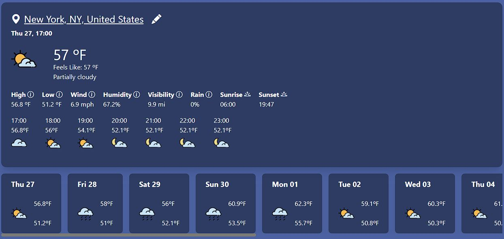
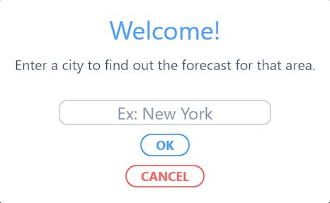

# Pronóstico de clima
Aplicación web enfocado a consultar el clima actual y de los próximos dias.

## Descripción del proyecto
El proyecto implementa la API de [visualcrossing](https://www.visualcrossing.com/weather-api) dando detalles meteorológicos del dia y de los próximos 14 días.

## Teconologías utilizadas

## Instrucciones de uso
1. Para acceder deberás hacer click [aquí](https://dariorv.github.io/Clima/) y serás redirigido al sitio web. Una vez allí podrás ingresar tu ciudad u otra donde quieras saber el pronóstico.  

2. Una vez configurada tu ciudad podrás ver los detalles del pronóstico.  

## Ultima actualización
Abril de 2023
